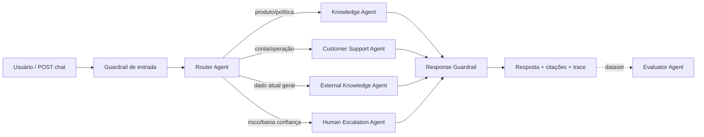

# Getnet Agent Ops

Sistema multiagente de atendimento Getnet com RAG, ferramentas de dados do cliente, fontes externas atuais, guardrails, handoff humano, tracing e um laboratório de avaliação **LLM-as-a-Judge**. A interface foi desenhada para tornar a arquitetura visível durante a demonstração.

  

## Executar

### Docker (recomendado)

```bash
cp .env.example .env
# preencha OPENROUTER_API_KEY
docker compose up --build
```

Abra [http://localhost:8000](http://localhost:8000). A documentação interativa fica em [http://localhost:8000/docs](http://localhost:8000/docs).

### Local

```bash
python -m venv .venv
source .venv/bin/activate
pip install -r requirements-dev.txt
uvicorn app.main:app --reload
```

O sistema possui fallback determinístico: use `DEMO_MODE=true` para demonstrar e testar sem consumir a API. Com `OPENROUTER_API_KEY` configurada, geração e avaliação semântica usam o modelo definido em `OPENROUTER_MODEL` (padrão `openai/gpt-4o-mini`).

## API

Endpoint pedido pelo desafio:

```bash
curl -X POST http://localhost:8000/chat \
  -H 'Content-Type: application/json' \
  -d '{"message":"Quando recebo as vendas de ontem?","user_id":"cliente1988"}'
```

A resposta inclui `answer`, `route`, `confidence`, `citations`, `handoff`, `trace_id` e todos os passos do trace. Outros endpoints:

| Método | Endpoint | Função |
|---|---|---|
| `GET` | `/health` | Saúde, modelo e modo do LLM |
| `POST` | `/chat` | Orquestra uma solicitação |
| `POST` | `/evaluations` | Avalia uma resposta informada ou gerada automaticamente |
| `GET` | `/metrics` | Latência, volume, handoff e traces recentes |

## Arquitetura e fluxo



1. O **guardrail** rejeita CPF, senha e credenciais antes de qualquer chamada ao modelo.
2. O **Router Agent** determina intenção, confiança e próximo agente. Intenções conhecidas usam classificação determinística de baixa latência; casos ambíguos usam o LLM.
3. O **Knowledge Agent** recupera documentos oficiais e só gera usando esse contexto.
4. O **Customer Support Agent** consulta dados privados por ferramentas bem delimitadas.
5. O **External Knowledge Agent** consulta APIs públicas para informações voláteis, como câmbio e clima.
6. O **Human Escalation Agent** prepara um handoff seguro quando há pedido explícito, risco ou baixa confiança.
7. A resposta passa por validação e recebe um trace correlacionável.

Essa orquestração é feita por chamadas internas assíncronas. A fronteira de cada agente é explícita e permite trocar a implementação por fila/eventos sem alterar os contratos HTTP.

## RAG: ingestão → armazenamento → recuperação → geração

- **Ingestão:** o corpus curado em `app/data/knowledge.json` sintetiza páginas oficiais da Getnet e guarda título, URL e conteúdo. Em produção, um job versionado faria crawl, limpeza, chunking, deduplicação e revisão de mudanças.
- **Armazenamento:** JSON versionado torna a avaliação reproduzível neste desafio. Em escala, os chunks e metadados iriam para pgvector/OpenSearch.
- **Recuperação:** `KnowledgeBase` usa um ranking lexical BM25-style transparente, sem serviço externo e com testes de relevância.
- **Geração:** os melhores trechos entram em um prompt que proíbe conhecimento fora do contexto. A resposta devolve as fontes usadas.

O corpus evita congelar condições comerciais como verdades eternas: preços, taxas e prazos recebem ressalva para conferência da oferta ou contrato vigente.

A ingestão reproduzível já está implementada e inclui a URL indicada no desafio. Para gerar um corpus bruto separado, sem sobrescrever o corpus curado:

```bash
python -m app.services.ingestion --output /tmp/getnet-corpus.json
```

O pipeline valida conteúdo HTML, remove scripts/estilos, normaliza texto, cria chunks sobrepostos e preserva URL/título. A busca geral usa APIs especializadas para clima/câmbio e uma tool de web search keyless como fallback, sempre retornando as fontes.

## Ferramentas do Customer Support Agent

1. `get_customer_profile(user_id)`: perfil mascarado, plano, terminal e flags operacionais.
2. `get_receivables(user_id)`: agenda de recebíveis do cliente.
3. `diagnose_terminal(user_id, symptom)`: telemetria, runbook e chamado existente.

Os dados em `customers.json` são fixtures sintéticas para demonstração. A camada `CustomerRepository` é a fronteira que seria substituída por CRM/ledger/telemetria reais, com autenticação e auditoria.

## Eval Lab

Na aba **Eval Lab**, informe:

- pergunta;
- resposta esperada;
- opcionalmente, a resposta real.

Se a resposta real ficar vazia, o sistema primeiro executa toda a orquestração e depois o **Evaluator Agent** julga correção factual, completude, relevância e segurança. O relatório traz nota de 0 a 1, justificativa, decisão `PASS/FAIL` e o `trace_id`. Sem LLM, um comparador lexical explícito garante testes offline; ele é fallback, não substituto da avaliação semântica em produção.

## Estratégia de testes

```bash
pip install -r requirements-dev.txt
DEMO_MODE=true pytest -q
```

A suíte cobre contrato HTTP, roteamento, RAG/ranking, uso das tools, cliente desconhecido, proteção de PII, handoff e os dois modos da avaliação (resposta fornecida ou gerada). O modo determinístico evita testes frágeis e custo de LLM em CI.

Para uma estratégia completa de produção:

- **unitários:** prompts renderizados, regras de rota, redaction e conectores;
- **integração:** APIs/CRM em sandbox, timeouts, retries, circuit breaker e schemas;
- **regressão de IA:** dataset versionado por intenção, judge calibrado com revisão humana, métricas de groundedness, recall de retrieval, resolução e taxa de handoff;
- **segurança:** prompt injection, vazamento cross-tenant, PII, abuso de tools e OWASP API Top 10;
- **carga e resiliência:** p95/p99, limites do provedor, indisponibilidade parcial e replay de traces.

## Observabilidade e decisões de produção

Cada resposta possui `trace_id`, agente escolhido, duração, tools/documentos e confiança. `/metrics` mantém uma janela em memória para a demo. Em produção, traces iriam para OpenTelemetry, métricas para Prometheus/Grafana e logs estruturados para uma plataforma central, sempre sem payload sensível. Alertas acompanhariam p95, erro do LLM, groundedness, custo por resolução e anomalias de handoff.

Resiliência já demonstrada: timeouts externos, fallback seguro, nenhuma operação financeira mutável, saída com confiança e handoff. Próximos passos seriam autenticação JWT/tenant, Redis para estado, rate limiting, vector DB e aprovação humana para ferramentas com efeito colateral.

## Roteiro do vídeo (5–7 minutos)

1. **00:00 — Problema e tese:** “Não construí só um chat; construí uma operação observável.” Mostre Console e Agent Trace.
2. **00:35 — Arquitetura:** abra este diagrama e explique router → especialista → guardrail, citando o avaliador como plano de qualidade.
3. **01:25 — RAG:** use **Comparar máquinas**. Mostre rota Knowledge, fontes oficiais e os documentos no trace.
4. **02:15 — Tools:** use **Consultar recebível** com `cliente1988`; destaque `get_customer_profile` e `get_receivables`. Troque para `cliente_demo2` e rode o diagnóstico.
5. **03:15 — Tempo real e segurança:** consulte euro; depois envie `Meu CPF é 123.456.789-00` e mostre o bloqueio antes do LLM.
6. **04:00 — Handoff:** peça atendimento humano e mostre a fila preparada no trace.
7. **04:35 — Eval Lab:** deixe “resposta real” vazia, execute e explique geração + LLM-as-a-Judge + quatro critérios + trace correlacionado.
8. **05:35 — Engenharia:** mostre `/docs`, um teste e o Dockerfile. Feche com métricas e próximos passos de produção.

Antes de gravar, rode `docker compose up --build`, confirme `/health`, deixe o navegador em 1440×900 e faça uma passagem pelos cinco botões de exemplo para aquecer caches e checar a rede.

## Estrutura

```text
app/
├── agents/       # router, knowledge, support, escalation/orchestration, evaluator
├── data/         # corpus Getnet e clientes sintéticos
├── services/     # OpenRouter, retrieval e tools
├── main.py       # FastAPI e contratos HTTP
└── models.py     # schemas tipados
static/           # console e Eval Lab
tests/            # API, agentes, RAG, guardrails e avaliações
```

## Fontes do corpus

- [Get Smart e Get Clássica](https://site.getnet.com.br/maquininha/get-smart/)
- [Get Conta](https://site.getnet.com.br/conta-digital/)
- [Link de Pagamento](https://site.getnet.com.br/santander-mobile-pf/)
- [Ajuda Getnet](https://site.getnet.com.br/get-ajuda/)
